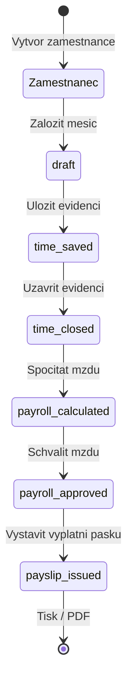

# Manual Workflow: Zamestnanec Az Po Vyplatni Pasku

## Uvod

Tento dokument je navod pro uzivatele, jak projit celym workflow od vytvoreni zamestnance az po tisk vyplatni pasky.

Tento navod je zalozen na realnem pruchodu zaznamenanem automatizaci v dokumentu [playwright-workflow-zamestnanec-vyplatni-paska.md](./playwright-workflow-zamestnanec-vyplatni-paska.md).

## Diagram Stavu

## Krok 1 - Vytvoreni Zamestnance

1. Otevri sekci `Zamestnanci`.
2. Klikni na `Novy zamestnanec`.
3. Vypln minimalne pole:
- `Jmeno`
- `Osobni cislo`
- `Datum nastupu`
- `Zakladni mzda`
4. Pro tisk pracovni smlouvy dopln i:
- `Adresa bydliste`
- `Druh prace`
- `Misto vykonu prace`
- `Pracovni doba / uvazek`
5. Klikni na `Ulozit osobni kartu`.

Co se stane:
- zamestnanec se zapise do `month-data/employees.json`
- karta dostane `employmentContractDocument`
- mesicni slozka se jeste nevytvori

## Krok 2 - Zalozeni Mesice

1. Prejdi do zalozky `Mzdy (Prehled mesicu)`.
2. Najdi pozadovany mesic, napr. `duben 2026`.
3. Klikni na `Zalozit mesic`.

Co se stane:
- vznikne soubor v `month-data/employees/<employeeId>/<month>.json`
- pocatecni stav mesice bude `draft`

## Krok 3 - Evidence Dochazky

Ocekavany flow:

1. Otevri `Evidence a Dochazka`.
2. Klikni na `Nacist dochazku`.
3. Predvypln mesic.
4. Zkontroluj nebo uprav radky evidence.
5. Klikni na `Ulozit evidenci`.

Aktualni overene chovani:

- po zalozeni mesice se negeneruji zadne radky evidence
- tabulka zustane prazdna
- bez dalsiho workaroundu neni mozne evidenci realne uzavrit

Overeny workaround z automatizovaneho pruchodu:

1. Dopsat radky evidence primo do mesicniho JSON souboru.
2. Pouzit `Nacist dochazku`.
3. Az po tomto kroku pokracovat na `Ulozit evidenci`.

Co se stane pri `Nacist`:
- dojde k nacteni radku pro dany mesic
- tabulka obsahuje jednotlive dny mesice

Co se stane pri `Predvyplnit`:
- pracovni dny se predvyplni jako pracovni smeny
- vikendy se predvyplni jako `volno`

Co se stane pri `Ulozit evidenci`:
- stav prejde na `time_saved`
- vytvori se `timeSheetDocument`

## Krok 4 - Uzavreni Evidence

1. V evidenci klikni na `Uzavrit evidenci`.

Co se stane:
- probehnou validace
- stav prejde na `time_closed`
- zapise se `closedAt`

## Krok 5 - Vypocet Mzdy

1. Vrat se do zalozky `Mzdy (Prehled mesicu)`.
2. Klikni na `Spocitat mzdu`.

Co se stane:
- stav prejde na `payroll_calculated`
- doplni se `payrollResult`
- doplni se `calculationSnapshot`

## Krok 6 - Schvaleni Mzdy

1. Klikni na `Schvalit mzdu`.

Co se stane:
- stav prejde na `payroll_approved`
- zapise se `approvedAt`

## Krok 7 - Vystaveni Vyplatni Pasky

UI cesta (blokovano):

- po schvaleni mzdy neni v UI k dispozici jednoznacna uzivatelska cesta pro vystaveni vyplatni pasky
- v overenem Playwright pruchodu bylo potreba pouzit interni workaround
- ciste pres aktualni UI neni tento krok spolehlive dokoncitelny

Poznamka pro uzivatele:

- tento krok je v aktualni verzi aplikace blokovany na urovni UX
- pokud nebude aplikace upravena, neni mozne garantovat vystaveni pasky pouze pres bezne klikani v rozhrani

Overena workaround cesta:

Predpoklady:
- zamestnanec je vytvoren
- mesic existuje
- evidence je ulozena
- evidence je uzavrena
- mzda je spocitana
- mzda je schvalena

Presna posloupnost:

1. Otevri data schvaleneho mesice.
2. Sestav `payslipDocument` nad existujicim `payrollResult`, `calculationSnapshot`, `timeSummary` a `paySlipInputs`.
3. Uloz mesic zpet se stavem `payslip_issued`.
4. Over, ze se v dokumentech objevi polozka `Vyplatni paska`.

Ocekavany vysledek:
- stav prejde na `payslip_issued`
- vznikne `payslipDocument`
- v dokumentech se objevi polozka `Vyplatni paska`

Co se stane:
- pri uspesnem vystaveni prejde stav na `payslip_issued`
- vznikne `payslipDocument`
- v dokumentech se objevi polozka `Vyplatni paska`

## Krok 8 - Tisk / PDF

UI cesta:

1. Vyber dokument `Vyplatni paska`.
2. Klikni na `Tisk / Ulozit PDF`.

Co se stane:
- spusti se tisk dokumentu
- aktivuje se tiskovy dokument `issued-payslip-document`

Overena workaround cesta:

1. Nejprve dokonci workaround z kroku 7 tak, aby dokument `Vyplatni paska` skutecne existoval.
2. Otevri zalozku `Dokumenty & Smlouvy`.
3. Vyber dokument `Vyplatni paska`.
4. Klikni na `Tisk / Ulozit PDF`.

Ocekavany vysledek:
- vyvola se `window.print()`
- aktivni tiskovy dokument bude `issued-payslip-document`
